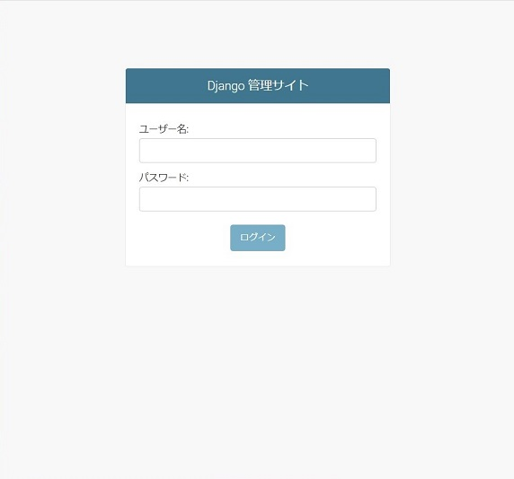
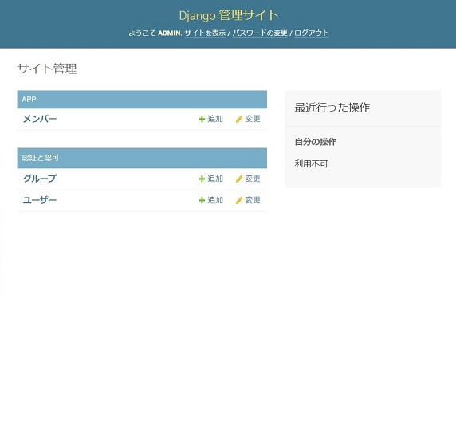
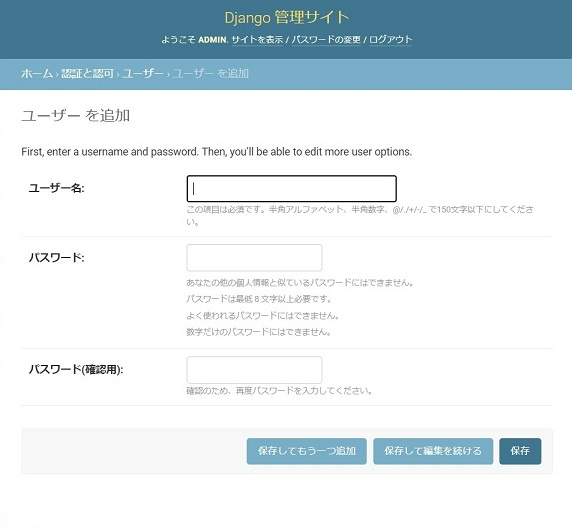
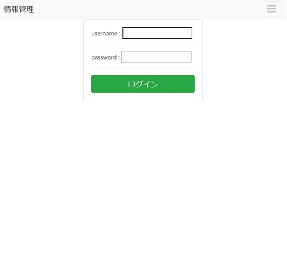
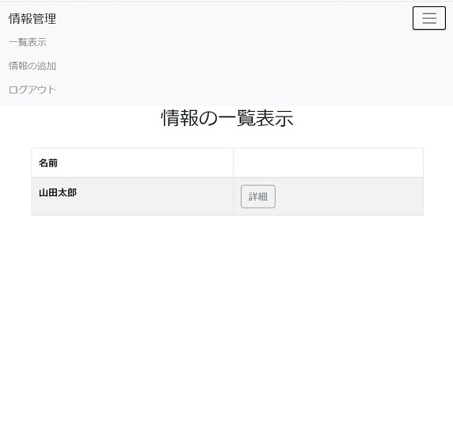
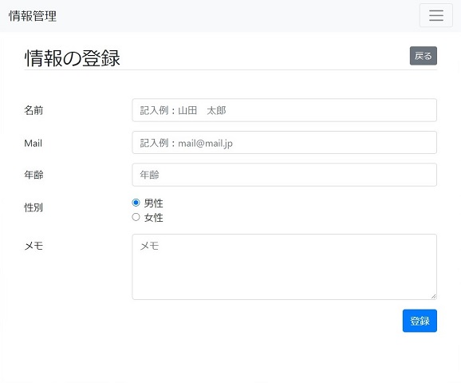
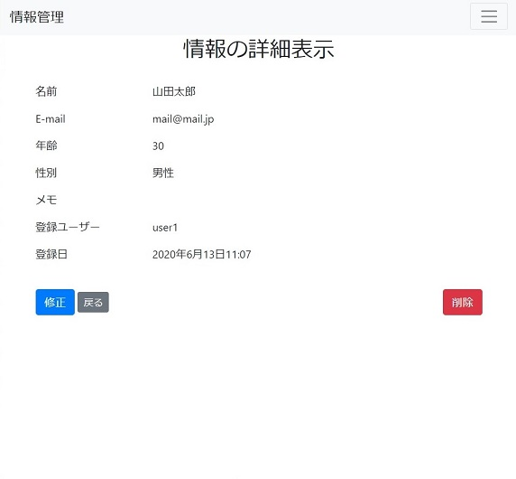
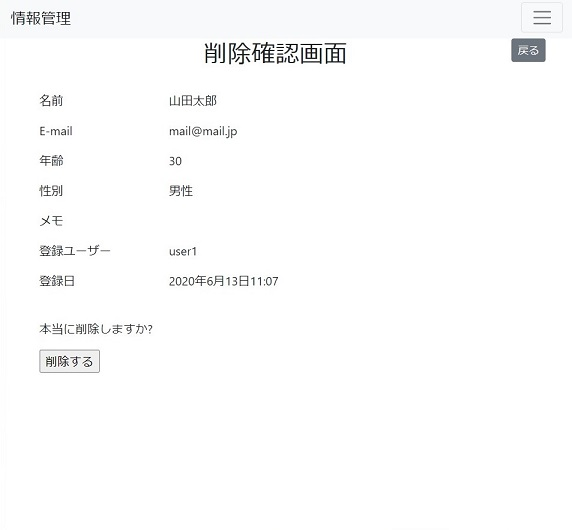

# 情報管理するwebアプリ
何らかの情報を管理するwebアプリのサンプルコード

## 概要
* 作成したアカウントのみログインして情報を管理する
* 情報を登録・削除する
* 情報を登録したユーザーと日付を記録する
  
## 機能
### 管理者
* アカウントの登録と削除
* 情報の登録と削除
* 情報の詳細情報の確認
    
### ユーザー    
* 情報の登録と削除
* 情報の詳細情報の確認 
    
## version
* python 3.8.0
* Django 3.0.7
* django-bootstrap4 2.0.1
  
## 実行方法
`pip install -r requirements.txt`\
`python manage.py makemigrations`\
`python manage.py migrate`\
`python manage.py createsuperuser`\
`python manage.py runserver`
  
## 画面サンプル
### 管理者
#### 管理者用ログイン画面
* python manage.py createsuperuserで作成した管理者ユーザーでログイン\

#### 管理者用TOP画面
* ユーザーをクリックするとアカウントの追加・削除ができる\

#### アカウントの登録
* ユーザー名・パスワードを入力してアカウントの登録\

### ユーザー
#### ログイン画面
* 管理ユーザーが作成したアカウントでログイン\

#### TOP画面
* 情報（名前のみ）のリストが表示される\
* 右上のメニューボタンをクリックすると**一覧表示（トップ画面）**、**情報の追加**、**ログアウト**ができる\

#### 情報の登録
* メニューボタンの情報の追加をクリックすると情報を登録できる\

#### 詳細の確認画面
* 各情報の詳細ボタンを押すと情報の詳細が表示される\

#### 情報の修正
* 詳細確認画面の修正ボタンを押すと内容の修正ができる\

### 情報の削除
* 削除ボタンを押すと削除確認画面が表示され、削除するボタンを押すと削除される\
